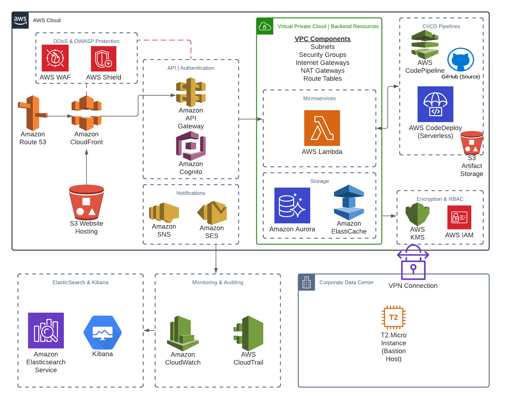

# devops-serverless-app-aws-cdk

DevOps IaC explorations building a real-world Serverless application using AWS CDK.

---

## Overview



---

## QRH Commands

```sh
# Install project dependencies
pip install -r requirements.txt

# List CDK Stacks
cdk ls

# Synthesize CDK Stacks
cdk synth

# Display CDK Stack changes
cdk diff <STACK_NAME> --profile <PROFILE_NAME>

# Deploy CDK Stack
cdk deploy <STACK_NAME> --profile <PROFILE_NAME>
```
---

## Technologies & Frameworks

- [AWS](https://aws.amazon.com/)
- [AWS CDK](https://aws.amazon.com/cdk/)
- [Python](https://www.python.org/)
- [Pip](https://pip.pypa.io/en/stable/)
